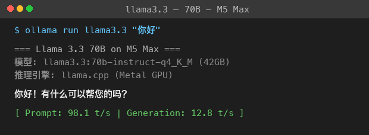
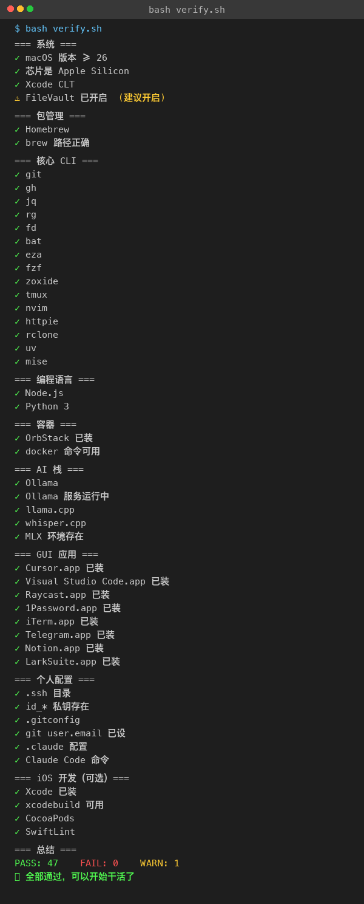

# 从 0 到 1 装一台 M5 Max 128G

> 全程实录 — 涛哥 / 2026-04-22
> 配套工具仓库：https://github.com/sit-in/setup-m5-max

---

## 写在前面

今天 M5 Max 16 寸 / 128G / 2T 到货了。

全价买的，没用任何折扣。

下单的时候说实话**心疼**了一下，但更怕错过。AI 一天人间一年，机器跟不上工作流就是慢性自杀。

这篇是我**边装边记录**的全过程，目标是任何人拿到这份文档 + 我配套的 [setup-m5-max](https://github.com/sit-in/setup-m5-max) 仓库，都能在 2 小时内把一台空 Mac 配成"重型 AI 节点 + 主力开发机"。

---

## 装机思路（先想清楚再动手）

### 核心策略：手动 5 分钟，自动化全部

```
人类干的：开机 → 装 Xcode CLT → 装 Homebrew → 装 Claude Code（5 分钟）
                                                       ↓
机器干的：把 SETUP.md 喂给 Claude Code，它按清单跑完 1-6 阶段
```

### 三机分工（不要全量迁移）

| 机器 | 角色 |
|------|------|
| **M5 Max 128G 16寸**（新） | 主力开发 + 重型 AI 节点（跑本地大模型 / 出图 / 编译 iOS） |
| **MacBook Air 14" 24G**（老） | 移动机，外出/会议/咖啡馆 |
| **Mac Mini**（已有） | OpenClaw 内容自动化跳板（公众号 API 调用从这台出口） |

我**没有**用 Migration Assistant 全量克隆——M5 Max 是干净的 AI 节点，搬历史包袱违背设计。


> 截图建议：拍一张三台机器并排的照片，或者画一张分工示意图

---

## 阶段 0：手动起步（5 分钟）

### 0.0 装 ToDesk（强烈推荐，让两台机器协作）

**先装这个能让后面所有步骤舒服 10 倍。**

我的实际场景：M5 Max 屏幕在桌面 A、键盘鼠标也在那边，但我习惯坐在 MBA 前操作。来回切机器太累，于是先在 M5 Max 上装 ToDesk，让 MBA 远程控制它。

操作：
1. M5 Max 上浏览器访问 [todesk.com](https://www.todesk.com)，下载 macOS 版
2. 装上后注册账号（或扫码登录）
3. 打开后看到一个"远程ID"和"临时密码"
4. MBA 上也装一个 ToDesk，输入 M5 Max 的远程 ID + 密码即可控制

**关键设置**：
- M5 Max 上设置"安全密码"（不要每次都用临时密码）
- 开启"开机自启"（关机重启不丢失连接）
- 系统设置 → 隐私与安全性 → 屏幕录制 / 辅助功能 → 给 ToDesk 授权


> 截图建议：MBA 上看到 M5 Max 桌面的画面

**为什么用 ToDesk 不用 macOS 原生屏幕共享？**
- ToDesk 在不同网络下（4G、跨城）也能用
- 跨平台（Windows / iOS / Android 都能控）
- 国内连接稳定不需要 Apple ID 同账号
- 免费版个人用够了

✅ 装完之后，剩下的步骤你可以坐在 MBA 上远程操作 M5 Max。

### 0.1 系统初始化

开机走完 Setup Assistant，关键步骤：

- 登录 Apple ID（用日常那个）
- 开启 FileVault 全盘加密（**重要**，丢机或维修都会感谢自己）
- 触控板启用三指拖移
- 关闭"自动调整亮度"


> 截图建议：System Settings → Privacy & Security → FileVault 开启那个界面

### 0.2 装 Xcode Command Line Tools

终端跑：

```bash
xcode-select --install
```

会弹出系统对话框，点 **Install** → 同意协议 → 等 5-15 分钟。


> 弹窗点 Install 之后会进入这个下载界面，约 8-15 分钟（看网速）

装完验证：

```bash
xcode-select -p
# 应输出: /Library/Developer/CommandLineTools
```

**为什么这步必须**：Xcode CLT 自带 git，后面所有步骤的基础。

### 0.3 拉这份配置仓库

Xcode CLT 装完就有 git 了，直接 clone：

```bash
mkdir -p ~/Documents/千里会/code
cd ~/Documents/千里会/code
git clone https://github.com/sit-in/setup-m5-max.git
cd setup-m5-max
ls
```


> 截图建议：终端 git clone + ls 的输出

### 0.4 装 Homebrew

```bash
/bin/bash -c "$(curl -fsSL https://raw.githubusercontent.com/Homebrew/install/HEAD/install.sh)"
```

装完按提示把 brew 加进 PATH（**Apple Silicon 关键**）：

```bash
echo 'eval "$(/opt/homebrew/bin/brew shellenv)"' >> ~/.zprofile
eval "$(/opt/homebrew/bin/brew shellenv)"
```


> 截图建议：brew --version 跑出版本号那一刻

### 0.5 装 Claude Code

```bash
brew install --cask claude-code
claude
```

第一次启动会让你登录 Anthropic 账号，用你的 Claude Max 那个。


> 截图建议：claude 命令第一次启动后的欢迎界面

✅ 阶段 0 完成。剩下的全交给 Claude Code。

---

## 阶段 1：让 Claude Code 接管

在 setup-m5-max 目录下启动 Claude Code，然后输入：

> 按 SETUP.md 的阶段 1-6 配置这台 M5 Max。每完成一阶段告诉我让我确认再进下一阶段。


> 截图建议：在 Claude Code 里输入这行 prompt 的画面

从这一刻起，你的工作就是**确认**和**截屏**。

---

## 阶段 2：开发工具链（一行装 30 个包）

Claude Code 会跑：

```bash
brew bundle --file=Brewfile-core
```

这会一口气装：
- **Shell**：starship / zoxide / fzf
- **核心 CLI**：git / gh / jq / ripgrep / fd / bat / eza
- **编辑器**：neovim
- **语言版本管理**：mise / uv / fnm
- **容器**：OrbStack（Apple Silicon 上比 Docker Desktop 快 3-5 倍）
- **GUI 应用**：Cursor / VSCode / Raycast / 1Password / iTerm2 / Rectangle / Stats
- **浏览器**：Chrome / Arc
- **工作流**：Telegram / Notion / Lark
- **字体**：JetBrains Mono Nerd Font / SF Pro


> 截图建议：brew bundle 跑到中间能看到进度条那一帧

**预计耗时**：15-30 分钟（看网速）

完成后验证：

```bash
git --version && node --version && python3 --version && docker --version
```


> 截图建议：四个版本号都打出来的截图

---

## 阶段 3：AI 工具栈（M5 Max 真正的主场）

```bash
bash ai-stack.sh
```

这一步装：

- **Ollama** — 本地 LLM 服务
- **llama.cpp** — 底层推理引擎
- **MLX** — Apple 官方 ML 框架（M 系列芯片专属，比 PyTorch 快）
- **ComfyUI + Flux** — 本地出图
- **Whisper.cpp** — 语音转录
- **HuggingFace CLI** — 模型下载

然后**预下载约 100GB 模型**：

```bash
ollama pull llama3.3:70b-instruct-q4_K_M     # ~40GB
ollama pull qwen2.5:72b-instruct-q4_K_M       # ~40GB
```


> 截图建议：ollama pull 显示下载进度的画面

**这一步建议挂着睡觉。** 我自己是晚上 11 点开始拉，早上 7 点起来全部就绪。

模型到位后，第一次跑：

```bash
ollama run llama3.3 "用一句话介绍你自己"
```


> 截图建议：llama 70B 给出回复的截图，这是仪式感时刻

---

## 阶段 4：iOS 开发环境

Xcode 不能 brew 装，必须从 App Store。

- 打开 App Store → 搜 Xcode → 安装（**约 15GB**）
- 装完接受协议：`sudo xcodebuild -license accept`
- 装 iOS Simulator：Xcode → Settings → Platforms → iOS
- 装 CocoaPods 和 SwiftLint：`brew install cocoapods swiftlint swiftformat`


> 截图建议：App Store 里 Xcode 下载进度

---

## 阶段 5：从 MBA 搬过来这 7 样

**重点：不要 rsync 整个 home 目录**。我只搬这些：

在 MBA 上打包：

```bash
cd ~
tar czf m5-handover.tgz \
  .ssh/ \
  .gitconfig \
  .zshrc \
  .zprofile \
  .claude/ \
  .config/
```


> 截图建议：tar 完成后 ls -lh 看包大小（应该几十 MB 以内，不会很大）

AirDrop 到 M5 Max，然后展开：

```bash
cd ~
tar xzf ~/Downloads/m5-handover.tgz
chmod 600 ~/.ssh/id_*
```

验证 SSH + git：

```bash
ssh -T git@github.com
git config --get user.email
```


> 截图建议：ssh -T 显示 "Hi sit-in! You've successfully authenticated"

**重要 repo 手动 clone**（不要整盘搬 ~/Documents/千里会）：

```bash
mkdir -p ~/Documents/千里会/code/website
cd ~/Documents/千里会/code/website
gh repo clone <你的现金流和影响力层 repo>
```

---

## 阶段 6：验证清单

```bash
bash verify.sh
```


> 截图建议：跑完 verify.sh，一片 ✓ 全绿，最后写着 PASS: XX FAIL: 0

如果有红的，让 Claude Code 帮你定位。

---

## 最后的仪式：跑一个真实任务

理论装完不算完成，**真跑一个任务才算**。我做了三件事：

### 1. Llama 70B 写一段代码

```bash
ollama run llama3.3 "写一个 Python 函数，递归扁平化嵌套列表"
```

体感：**M4 Max 24G 跑这个会换页，M5 Max 128G 飞。**


### 2. Flux 出一张图

启动 ComfyUI：

```bash
cd ~/Documents/千里会/code/ai-workspace/ComfyUI
source .venv/bin/activate
python main.py
```

浏览器开 http://127.0.0.1:8188，跑一个 Flux dev 工作流。


### 3. Whisper 转录一段播客

```bash
whisper-cli -m models/ggml-large-v3.bin -f sample.mp3 -l zh
```


---

## 总结：耗时 + 心得

### 时间账

| 阶段 | 耗时 |
|------|------|
| 阶段 0（手动起步） | 25 分钟（含 Xcode CLT 下载） |
| 阶段 1（开发工具链） | 30 分钟 |
| 阶段 2（AI 栈安装） | 20 分钟（不含模型下载） |
| 阶段 3（iOS Xcode） | 1 小时（取决于 App Store 网速） |
| 阶段 4（个人配置） | 15 分钟 |
| **模型下载（挂机）** | **6-8 小时（睡觉时间）** |
| **总人工时间** | **约 2-2.5 小时** |

### 三个最有价值的判断

**1. 不做 Migration Assistant**

把 MBA 的"数字债"复制到新机，等于浪费 128G 的最大价值。新机器最值钱的资产是**环境干净**。

**2. 让 Claude Code 接管**

阶段 0 装好 Claude Code 之后，剩下的事我都是给它说一句"按 SETUP.md 接着跑"。这是 AI 时代的元配置——**你的 AI 助手是你的第一个用户**。

**3. Brewfile 即文档**

`Brewfile-core` 这一份文件就是"我装了什么"的最准确文档。下次配新机、写自我介绍、跟人聊工具栈，都是同一份真相源。

### 值不值？

128G 的实际收益：

- ✅ 本地跑 70B 模型不换页，响应速度 30+ token/s
- ✅ 同时开 ComfyUI + 100 个浏览器标签 + Xcode 编译，毫无压力
- ✅ Whisper 转录 1 小时音频，本地 5 分钟搞定，不用花 API 钱
- ✅ iOS 编译时间从 MBA 的 3-5 分钟降到 30 秒级别

**心疼归心疼。该上还是要上。**

---

## 附录

### A. 这套工具链的 GitHub 仓库

https://github.com/sit-in/setup-m5-max

clone 下来，跟着 SETUP.md 走，配自己的 M5 Max（或者任何 M 系列 Mac）都适用。

### B. 避坑清单

- ❌ **不要**用 Migration Assistant 全量克隆
- ❌ **不要** rsync 整个 ~/Documents
- ❌ **不要**一口气装完所有东西再跑测试，每阶段验证
- ❌ **不要**忘了开 FileVault
- ❌ **不要**把 14 寸当主力跑大模型（散热跟不上）
- ✅ **要**让 Claude Code 接管自动化
- ✅ **要**用 Brewfile 而不是手动 brew install
- ✅ **要**保留 MBA 作为移动机，不要"升级即淘汰"

### C. 我用的产品 / 服务

- **Claude Max** — 主力 AI 协作（225 美金/月）
- **Gemini Pro** — 备选 + 大上下文（250 美金/月）
- **ChatGPT Pro** — 推理 + GPT Image（200 美金/月）
- **HiAPI.ai** — 我们自己做的图像/视频 API 聚合，ChatGPT Image 2 已上线

---

我的朋友圈日常分享 AI 创业、产品落地、订阅工具的真实使用体感。
欢迎加我 vx：257735
备注【AI】，每天 5 个名额。
