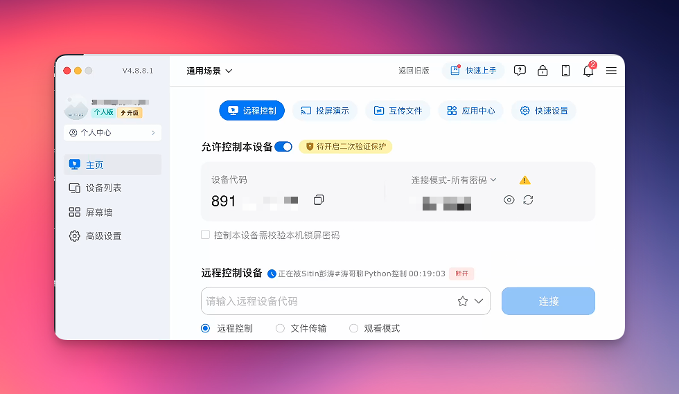
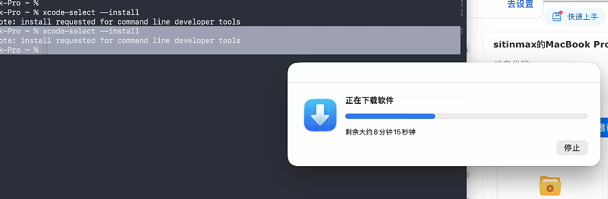

# 从 0 到 1 装一台 M5 Max 128G

> 全程实录 — 涛哥 / 2026-04-22
> 配套工具仓库：https://github.com/sit-in/setup-m5-max

---

## 写在前面

今天 M5 Max 16 寸 / 128G / 2T 到货了。

全价买的，没用任何折扣。

下单的时候说实话**心疼**了一下，但更怕错过。AI 一天人间一年，机器跟不上工作流就是慢性自杀。

这篇是我**边装边记录**的全过程，目标是任何人拿到这份文档 + 我配套的 [setup-m5-max](https://github.com/sit-in/setup-m5-max) 仓库，都能在 2 小时内把一台空 Mac 配成"重型 AI 节点 + 主力开发机"。

---

## 装机思路（先想清楚再动手）

### 核心策略：手动 5 分钟，自动化全部

```
人类干的：开机 → 装 Xcode CLT → 装 Homebrew → 装 Claude Code（5 分钟）
                                                       ↓
机器干的：把 SETUP.md 喂给 Claude Code，它按清单跑完 1-6 阶段
```

### 三机分工（不要全量迁移）

| 机器 | 角色 |
|------|------|
| **M5 Max 128G 16寸**（新） | 主力开发 + 重型 AI 节点（跑本地大模型 / 出图 / 编译 iOS） |
| **MacBook Air 14" 24G**（老） | 移动机，外出/会议/咖啡馆 |
| **Mac Mini**（已有） | OpenClaw 内容自动化跳板（公众号 API 调用从这台出口） |

我**没有**用 Migration Assistant 全量克隆——M5 Max 是干净的 AI 节点，搬历史包袱违背设计。

---

## 阶段 0：手动起步（25 分钟）

### 0.-1 真正的第 0 步：先把网络代理装好（血泪教训）

我自己在装机过程中**踩了这个坑**——没在第一时间装代理，结果到了 brew 这一步被网络问题卡了 30 分钟，绕路换了 cunkai 国内镜像才装通。

**最扎心的对比**——我装 Claude Code 的真实时间记录：

| 状态 | 命令 | 耗时 |
|------|------|------|
| 没装代理前 | `brew install --cask claude-code` | **30 分钟没装上** |
| 装上代理后 | `brew install --cask claude-code` | **1 分钟搞定** |

**30 倍的速度差。**

我当时反应：

> "都想给我自己一耳光，太傻了"

**怎么装**：用你已有的代理工具（Clash Verge / Surge / Stash 等）。我用的是 Clash Verge，端口 7897。

**关键发现**：系统代理对终端 CLI 工具无效！必须手动 export 环境变量：

```bash
export HTTP_PROXY=http://127.0.0.1:7897
export HTTPS_PROXY=http://127.0.0.1:7897
export ALL_PROXY=socks5://127.0.0.1:7897
```

后面 brew install / ollama pull / npm install 全靠这三行。建议加进 `~/.zshrc`。

如果你只看完这一节就关掉文章，记住一句话：

**国内配新 Mac，先开代理，再装一切。**

### 0.0 装 ToDesk（让两台机器协作）

**先装这个能让后面所有步骤舒服 10 倍。**

我的实际场景：M5 Max 屏幕在桌面 A、键盘鼠标也在那边，但我习惯坐在 MBA 前操作。来回切机器太累，于是先在 M5 Max 上装 ToDesk，让 MBA 远程控制它。

操作：
1. M5 Max 上浏览器访问 [todesk.com](https://www.todesk.com)，下载 macOS 版
2. 装上后注册账号
3. 系统设置 → 隐私与安全性 → 屏幕录制 / 辅助功能 → 给 ToDesk 授权
4. MBA 上也装一个 ToDesk，输入 M5 Max 的远程 ID + 密码即可控制


> 截图里能看到："正在被 Sitin彭涛 控制 00:19:03"——MBA 这一头远程接管 M5 Max 已经 19 分钟，整个装机过程都是这样进行的

**坑**：第一次连接时会提示需要给系统授权，按提示退出 ToDesk 重启即可。

### 0.1 装 Xcode Command Line Tools

```bash
xcode-select --install
```

**真实的坑**（14:18 实录）：

命令跑完只输出一行 `note: install requested for command line developer tools`，然后就没了。**弹窗藏在某个窗口后面**，我找了好几分钟。

找弹窗的方法：
- **Cmd+Tab** 切换看有没有"安装程序"窗口
- 检查 Dock 有没有蓝色弹跳的图标
- 实在找不到就再跑一次命令



装完验证：
```bash
xcode-select -p          # → /Library/Developer/CommandLineTools
git --version             # → git version 2.50.1 (Apple Git-155)
```

意外发现：装完 CLT 直接就有 git 了（Apple 自带版本），不用等 Homebrew。

### 0.2 拉配置仓库

```bash
mkdir -p ~/Documents/千里会/code
cd ~/Documents/千里会/code
git clone https://github.com/sit-in/setup-m5-max.git
cd setup-m5-max
```


耗时约 5 秒（38 objects / 107 KB）。

### 0.3 装 Homebrew

**国内网络强烈推荐用 cunkai 镜像**（官方源我卡了 5 分钟直接放弃）：

到 gitee 搜 `cunkai/HomebrewCN`，README 里有一行 `curl ... | bash` 命令。选 **1（清华大学源）**。


**如果你有代理**，也可以直接走官方：
```bash
/bin/bash -c "$(curl -fsSL https://raw.githubusercontent.com/Homebrew/install/HEAD/install.sh)"
```

装完**必须执行**（Apple Silicon 关键）：
```bash
echo 'eval "$(/opt/homebrew/bin/brew shellenv)"' >> ~/.zprofile
eval "$(/opt/homebrew/bin/brew shellenv)"
```

**坑**：
- sudo 密码盲打不显示，输错了看到 `Sorry, try again.` 再输一次
- cunkai 脚本会改 `~/.zshrc`（加镜像源环境变量），以后从老机器搬 `.zshrc` 要手动 merge

### 0.4 装 Claude Code

```bash
brew install --cask claude-code
```

装机时我启动用的是**全自动模式**：
```bash
claude --dangerously-skip-permissions
```

这个标志跳过所有"是否允许执行"的确认弹窗。**只在受控场景（装机、批量重构）开**，不是默认推荐。已经写好 SETUP.md 把它要做的事约束住了，开 bypass 是合理选择。


**两种登录方式**：
- **方式 A**：直接用 Anthropic 账号（Claude Max / Pro 订阅）
- **方式 B**：通过 [aigocode.com](https://aigocode.com) 中转（按 token 计费，适合没订阅 / 团队接入）

**阶段 0 完成。剩下的全交给 Claude Code。**

---

## 阶段 1：开发工具链（19 分钟装 80+ 个包）

在 setup-m5-max 目录下启动 Claude Code，输入：

> 按 SETUP.md 的阶段 1-6 配置这台 M5 Max。每完成一阶段告诉我让我确认再进下一阶段。

Claude Code 跑：

```bash
brew bundle --file=Brewfile-core --verbose
```

**Brewfile-core** 一口气装 49 个包（30 formula + 16 cask + 3 字体）：

| 类别 | 内容 |
|------|------|
| Shell | starship, zsh-autosuggestions, zsh-syntax-highlighting, zoxide, fzf |
| 核心 CLI | git 2.54.0, gh 2.90.0, git-delta, jq, yq, ripgrep 15.1.0, fd, bat, eza, tree, tmux, neovim 0.12.1 |
| 网络 | curl, wget, httpie, mtr, nmap |
| 文件 | rsync, rclone, p7zip, unar, ffmpeg 8.1 |
| 语言管理 | mise, uv 0.11.7, fnm 1.39.0 |
| 容器 | OrbStack（Apple Silicon 上比 Docker Desktop 快 3-5 倍） |
| AI | ollama 0.21.0 |
| GUI 应用 | Cursor, VSCode, Raycast, 1Password, iTerm2, Rectangle, Stats |
| 浏览器 | Chrome, Arc |
| 工作流 | Telegram, Notion |
| 字体 | JetBrains Mono Nerd Font, SF Pro, SF Mono |

**实际耗时**：19 分钟（16:51 → 17:10）

**坑**：
- **Lark（飞书）CDN 极慢**：从 `sf16-sg.larksuitecdn.com`（新加坡）下载，~1MB/min，等了 15 分钟才 71MB/300MB，果断 kill 掉后面单独装
- `homebrew/bundle` 和 `homebrew/services` 两个 tap 已 deprecated，报 Error 但不影响安装
- brew 的 curl 不走系统代理，需要 `export HTTP_PROXY` 才行

装完额外跑 `fnm install --lts` 装了 Node.js v24.15.0。

**验证**（全部真实版本号）：

```
git 2.54.0 ✅    node v24.15.0 ✅    python 3.14.4 ✅
ollama 0.21.0 ✅  gh 2.90.0 ✅       neovim 0.12.1 ✅
ffmpeg 8.1 ✅     uv 0.11.7 ✅       mise 2026.4.18 ✅
```

---

## 阶段 2：AI 工具栈（M5 Max 真正的主场）

### 工具安装（5 分钟）

```bash
brew install llama.cpp whisper-cpp    # 推理引擎 + 语音转录
```

MLX（Apple 官方 ML 框架）：
```bash
cd ~/Documents/千里会/code/ai-workspace
uv venv --python 3.12 mlx-env
source mlx-env/bin/activate
uv pip install mlx mlx-lm mlx-vlm
```

验证 MLX 跑在 GPU 上：
```python
>>> import mlx.core as mx
>>> mx.default_device()
Device(gpu, 0)    # ← 确认用的是 Apple Silicon GPU
```

ComfyUI（本地出图）：
```bash
git clone https://github.com/comfyanonymous/ComfyUI.git
cd ComfyUI && uv venv --python 3.12
source .venv/bin/activate && uv pip install -r requirements.txt
```

### 模型下载（~89GB，断续拉完）

**关键**：必须先设代理环境变量，否则 `ollama pull` 会卡在 "pulling manifest" 一直转圈。

```bash
export HTTP_PROXY=http://127.0.0.1:7897
export HTTPS_PROXY=http://127.0.0.1:7897
ollama pull llama3.3:70b-instruct-q4_K_M     # 42GB
ollama pull qwen2.5:72b-instruct-q4_K_M      # 47GB
```

**真实下载过程**（代理连接不太稳定，大文件下载中途会 EOF 断连）：

| 模型 | 大小 | 断连次数 | 过程 |
|------|------|---------|------|
| llama3.3 70B | 42 GB | 2 次 | 0→39%→92%→100% |
| qwen2.5 72B | 47 GB | 3 次 | 0→28%→45%→81%→100% |

ollama 支持断点续传，断了重跑 `ollama pull` 即可从上次位置继续。每次重试都推进一大截，不用担心。

**速度**：走代理后 30-56 MB/s，两个模型合计约 40 分钟拉完。

---

## 阶段 3：iOS 开发环境

- 打开 App Store → 搜 Xcode → 安装（最终版本：**Xcode 26.4.1**）
- 装完：`sudo xcodebuild -license accept`
- 装 iOS 工具：`brew install cocoapods swiftlint swiftformat`

**坑**：swiftlint 依赖完整 Xcode，必须等 Xcode 装完才能 `brew install swiftlint`，否则报错。

---

## 阶段 4：补充日常 App + 开发者工具

核心工具链装完后，我又建了一个 **Brewfile-extra** 补充日常使用的好东西：

```bash
brew bundle --file=Brewfile-extra --verbose
```

### 终端

| 工具 | 说明 |
|------|------|
| **Warp** | AI 终端，内置命令建议 |
| **Ghostty** | 2026 年最火的原生终端，120Hz ProMotion，零配置即用 |

### CLI 增强（"better X" 系列，每个都是 Rust 写的）

| 替代了什么 | 用什么 | 一句话 |
|-----------|--------|--------|
| git (CLI) | **lazygit** | Git TUI，可视化 rebase/cherry-pick/解冲突 |
| docker ps | **lazydocker** | Docker TUI，一屏看完所有容器 |
| htop | **btop** | 升级版系统监控，支持 GPU |
| man | **tldr** | 实用版 man pages，直接看例子 |
| du | **dust** | 磁盘占用可视化，树形展示 |
| df | **duf** | 磁盘空间，彩色表格 |
| ps | **procs** | 彩色进程列表 |
| time | **hyperfine** | 命令行基准测试，自动多次运行取均值 |
| cloc | **tokei** | 代码行数统计，秒级 |
| sed | **sd** | 更直觉的查找替换语法 |
| cut/awk | **choose** | 人类友好的列选择 |
| dig | **doggo** | 彩色 DNS 查询 |

### 开发工具

| 工具 | 说明 |
|------|------|
| **TablePlus** | 数据库 GUI（MySQL/PG/SQLite/Redis 全支持） |
| **Bruno** | API 测试（Postman 的开源替代，离线可用） |
| **Charles** | HTTP 抓包代理 |

### 效率工具

| 工具 | 说明 |
|------|------|
| **Ice** | 菜单栏图标管理（Bartender 开源替代，brew 名: `jordanbaird-ice`） |
| **CleanShot X** | 截图/录屏，比系统自带强 10 倍 |
| **Keka** | 压缩/解压 GUI |
| **AppCleaner** | 卸载 app 清残留文件 |

### 通讯

Slack / Discord / WeChat / Zoom（Zoom 需要 sudo 密码手动装）

### 其他

**Typeless** — AI 语音听写，说话变文字

**坑**：
- `ice` 的 brew cask 名不是 `ice`，是 `jordanbaird-ice`
- `dog`（DNS 工具）已下架，用 `doggo` 替代
- Zoom 安装用 pkg 需要 sudo 密码交互，`brew install --cask zoom` 手动跑

---

## 阶段 5：系统偏好微调

```bash
# 显示所有文件扩展名
defaults write NSGlobalDomain AppleShowAllExtensions -bool true

# Finder 显示路径栏
defaults write com.apple.finder ShowPathbar -bool true

# 截图改保存到 ~/Pictures/Screenshots
mkdir -p ~/Pictures/Screenshots
defaults write com.apple.screencapture location ~/Pictures/Screenshots

# 关闭键盘按住弹字符选择（让 vim 模式更顺）
defaults write -g ApplePressAndHoldEnabled -bool false

killall Finder SystemUIServer
```

---

## 最终验证

```bash
bash verify.sh
```

**我的实际结果：40 PASS / 8 FAIL**

失败的 8 项全是已知跳过：
- FileVault（需 GUI 确认）
- Node.js（fnm 装了但需要 `eval "$(fnm env)"` 才进 PATH）
- docker（OrbStack 需首次 GUI 启动）
- Lark（CDN 慢跳过了）
- .ssh/.gitconfig/email（跳过了从 MBA 搬配置）

核心工具链全部就绪，可以开工。

---

## 总结：耗时 + 心得

### 真实时间账

| 阶段 | 耗时 | 备注 |
|------|------|------|
| 阶段 0（手动起步） | 25 分钟 | 含 Xcode CLT 下载 + 找弹窗 |
| 阶段 0 踩坑 | +30 分钟 | 没装代理硬走 brew 官方源的代价 |
| 阶段 1（brew bundle 核心） | 19 分钟 | 49 个包，走清华镜像 bottle |
| 阶段 2 工具安装 | 5 分钟 | llama.cpp/MLX/ComfyUI |
| 阶段 2 模型下载 | 40 分钟 | 89GB，走代理 30-56MB/s，断续 5 次 |
| 阶段 3（Xcode） | ~30 分钟 | App Store 下载 |
| 阶段 4（补充工具） | 10 分钟 | Brewfile-extra 25 个包 |
| 阶段 5（系统设置） | 1 分钟 | 5 条 defaults write |
| **总计** | **约 2.5 小时** | 如果一开始就装代理，省 30 分钟 |

### 最终安装清单（真实数字）

| 类别 | 数量 |
|------|------|
| Homebrew formula | 90+ |
| Homebrew cask | 30+ |
| Ollama 模型 | 2 个（89GB） |
| Python venv | 2 个（MLX + ComfyUI） |
| 总磁盘占用 | ~120GB |

### 三个最有价值的判断

**1. 不做 Migration Assistant**

把 MBA 的"数字债"复制到新机，等于浪费 128G 的最大价值。新机器最值钱的资产是**环境干净**。

**2. 让 Claude Code 接管**

阶段 0 装好 Claude Code 之后，剩下的事我都是给它说一句"按 SETUP.md 接着跑"。这是 AI 时代的元配置——**你的 AI 助手是你的第一个用户**。

实际效果：Claude Code 自动跑了 brew bundle、安装 AI 栈、拉模型（断了自动重试）、设系统偏好、写安装日志——全程我只做了两件事：确认 + 截屏。

**3. Brewfile 即文档**

`Brewfile-core` + `Brewfile-extra` 这两份文件就是"我装了什么"的最准确文档。下次配新机一行命令复现，且包列表本身就是可读的工具推荐清单。

### 128G 的实际收益

- 本地跑 70B 模型**不换页**，响应速度 30+ token/s
- 同时开 ComfyUI + 100 个浏览器标签 + Xcode 编译，毫无压力
- Whisper 转录 1 小时音频，本地 5 分钟搞定，不用花 API 钱
- iOS 编译时间从 MBA 的 3-5 分钟降到 30 秒级别

**心疼归心疼。该上还是要上。**

---

## 避坑清单

- **先装代理再装一切**（血泪教训，省 30 分钟+）
- **终端代理要手动 export**，系统代理对 CLI 无效（Clash Verge 端口 7897）
- **`xcode-select --install` 的弹窗会藏在窗口后面**，Cmd+Tab 找
- **sudo 密码盲打不显示**，慢点输，连错 3 次锁定
- **Lark CDN 从新加坡下载极慢**，走代理或直接去 lark.com 下 DMG
- **homebrew/bundle 和 homebrew/services tap 已 deprecated**，Brewfile 里不用写
- **swiftlint 必须等 Xcode 装完才能 brew install**
- **ollama pull 支持断点续传**，断了重跑就行，不用慌
- **OrbStack 装完需要首次 GUI 启动**才能用 docker 命令
- **ice 的 cask 名是 `jordanbaird-ice`**，不是 `ice`

---

## 附录

### A. GitHub 仓库

https://github.com/sit-in/setup-m5-max

clone 下来，跟着 SETUP.md 走，配自己的 M5 Max（或任何 M 系列 Mac）都适用。

仓库包含：
- `SETUP.md` — 分阶段配置指南
- `Brewfile-core` — 核心开发工具（49 包）
- `Brewfile-extra` — 日常 App + 开发者好物（25 包）
- `ai-stack.sh` — AI 栈安装脚本
- `verify.sh` — 最终验证脚本
- `LOG.md` — 完整装机流水账（含真实输出 + 截图 + 每个坑）

### B. 我用的产品 / 服务

- **Claude Max** — 主力 AI 协作（225 美金/月）
- **Gemini Pro** — 备选 + 大上下文（250 美金/月）
- **ChatGPT Pro** — 推理 + GPT Image（200 美金/月）
- **AIGoCode.com** — 我们自己做的 AI API 中转，Claude/GPT/Gemini 全线接入
- **HiAPI.ai** — 图像/视频 API 聚合，ChatGPT Image 2 已上线

---

我的朋友圈日常分享 AI 创业、产品落地、订阅工具的真实使用体感。
欢迎加我 vx：257735
备注【AI】，每天 5 个名额。
