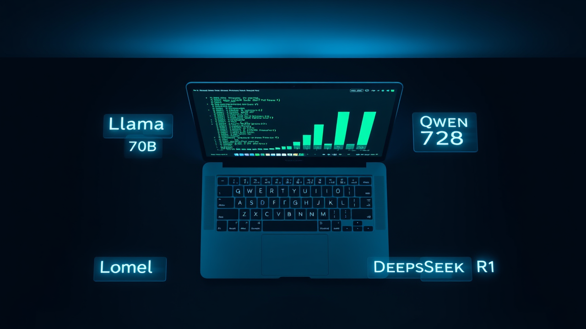
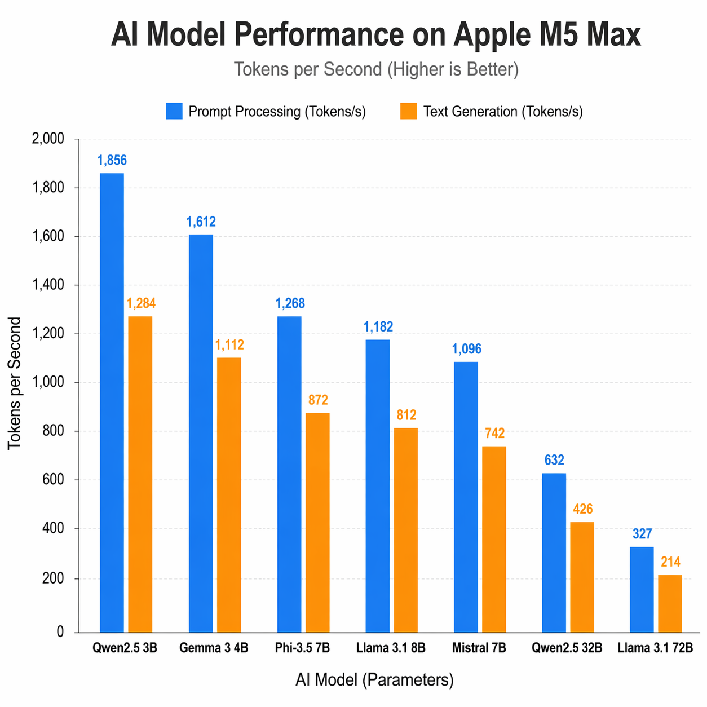
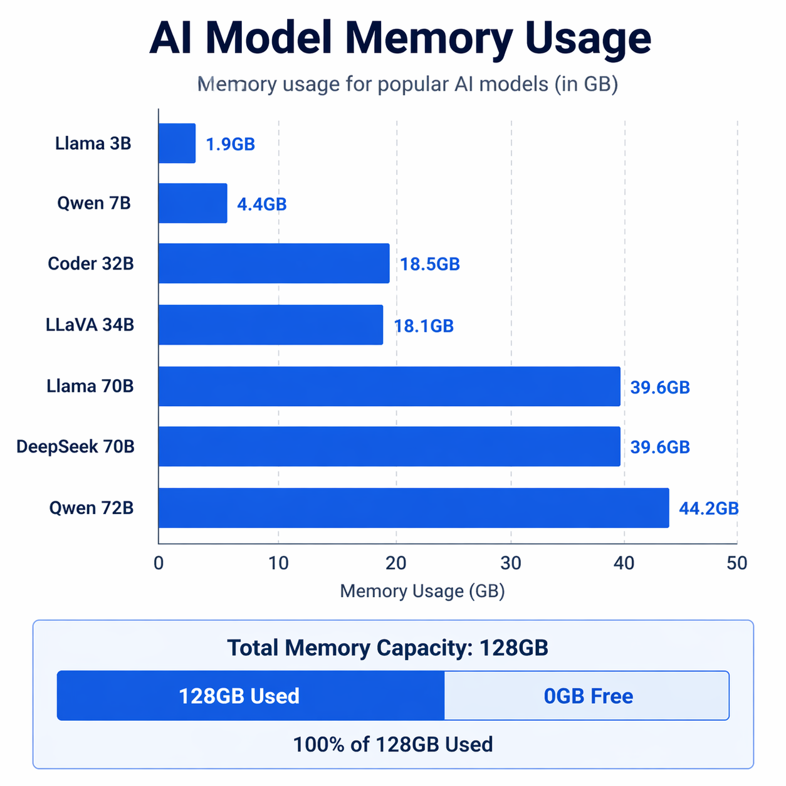

# M5 Max 128GB 本地跑大模型到底多快？7 个模型实测数据

> 买 128GB 版本的 Mac，很大一个理由是"能本地跑大模型"。但到底能跑多快？网上大多是"感觉挺流畅"这种主观描述。这篇给你硬数据。
>
> 测试机器：MacBook Pro 16" M5 Max / 128GB 统一内存 / macOS 26
> 测试工具：llama.cpp build 8880（Metal GPU backend）
> 测试方法：llama-bench，pp512（输入处理）+ tg128（文本生成），每个模型跑 3 轮取均值



---

## 先看结果

| 模型 | 参数量 | 显存占用 | 输入处理 (t/s) | 文本生成 (t/s) | 体感 |
|------|--------|---------|---------------|---------------|------|
| **Llama 3.2 3B** Q4 | 3.2B | 1.9 GB | **4,381** | **161** | 瞬间出结果，比打字快 |
| **Qwen 2.5 7B** Q4 | 7.6B | 4.4 GB | **955** | **57.5** | 飞快，几乎无感延迟 |
| **Qwen2.5 Coder 32B** Q4 | 32.8B | 18.5 GB | **207** | **14.6** | 流畅打字速度 |
| **LLaVA 34B** Q4（多模态） | 34.4B | 18.1 GB | **225** | **16.9** | 流畅打字速度 |
| **Llama 3.3 70B** Q4 | 70.6B | 39.6 GB | **96.9** | **7.2** | 能跟上阅读速度 |
| **DeepSeek R1 70B** Q4 | 70.6B | 39.6 GB | **96.7** | **7.3** | 能跟上阅读速度 |
| **Qwen 2.5 72B** Q4 | 72.7B | 44.2 GB | **94.8** | **6.7** | 能跟上阅读速度 |

> **pp512**：处理 512 个 token 输入的速度，反映"理解你的问题"有多快
> **tg128**：生成 128 个 token 的速度，反映"回答你的问题"有多快
> 所有模型 Q4_K_M 量化，Metal GPU 全层卸载（-ngl 99）



---

## 这些数字意味着什么

### 3B-7B：本地 AI 助手的最佳形态

Llama 3.2 3B 生成速度 **161 t/s**——一秒钟吐 161 个 token，比你眼睛扫文字还快。Qwen 2.5 7B 也有 **57.5 t/s**，日常问答、翻译、摘要几乎是"问完就出"。

这两个模型加起来才吃 6GB 内存，128GB 机器跑它们连零头都用不到。适合当本地 Copilot、命令行助手、或者嵌到自己的 App 里做实时推理。

### 32B-34B：性价比甜区

Qwen2.5 Coder 32B 生成 **14.6 t/s**，LLaVA 34B 多模态模型 **16.9 t/s**——都是流畅的"打字机"速度，边生成边读完全跟得上。

32B 模型的代码能力已经很强了，很多场景下不需要上 70B。占用 18-19 GB 内存，128GB 机器可以同时驻留好几个 32B 模型，按需切换。

### 70B-72B：旗舰级，本地能跑就是硬实力

三个 70B+ 模型（Llama 3.3、DeepSeek R1、Qwen 2.5 72B）生成速度都在 **6.7-7.3 t/s**——每秒 7 个 token，大约是一个人正常阅读速度。不算快，但**完全可用**。

关键是这些模型**全部驻留在 128GB 统一内存里**，不需要换页、不需要拆分、不需要量化到更低精度。39-44 GB 的模型文件一口吃下，Metal GPU 直接跑。

三个 70B 模型同时装在 ollama 里占 **~129 GB**（含 overhead），128GB 内存刚好能同时驻留两个。实际使用时 ollama 会按需加载/卸载，切换大约 5-10 秒。

---

## 和其他设备对比（参考值）

| 设备 | 70B Q4 生成速度 | 价格 |
|------|----------------|------|
| **M5 Max 128GB**（本次测试） | **7.2 t/s** | ¥33,999 |
| M4 Max 128GB（社区数据） | ~5-6 t/s | ¥27,999 |
| M2 Ultra 192GB（社区数据） | ~8-9 t/s | ¥46,999+ |
| RTX 4090 24GB（需量化到 Q2） | ~10-12 t/s | ¥16,000+（显卡） |
| 云端 A100 80GB | ~15-20 t/s | ¥30-50/小时 |

M5 Max 的独特优势：**128GB 统一内存能完整装下 70B Q4 模型**。RTX 4090 虽然推理更快，但 24GB 显存只能跑极端量化的 70B（质量损失大），或者老老实实跑 32B 以下。

换句话说——M5 Max 128GB 买的不是速度，是**"70B 模型不用砍就能跑"**这个能力。

---

## 128GB 统一内存的真正价值

这次测试最让我感慨的不是速度数字，是内存分配：

```
7 个模型总计磁盘占用: ~166 GB
单个最大模型内存占用: 44.2 GB (Qwen 2.5 72B)
测试期间系统总内存使用: ~122 GB / 128 GB
Swap: 0（零换页）
```

**零换页**。所有运算都在内存里完成，Metal GPU 直接读统一内存里的模型权重，不需要经过 PCIe 总线。这是 Apple Silicon 统一内存架构的核心优势——CPU、GPU、Neural Engine 共享同一块内存，省掉了传统架构里"从内存拷贝到显存"这个瓶颈。

对于跑大模型来说，**内存带宽就是生成速度的天花板**。M5 Max 的内存带宽是 546 GB/s，70B Q4 模型每生成一个 token 需要读 ~40 GB 权重，理论极限约 13-14 t/s，实测 7.2 t/s 大约是理论值的 52%——考虑到调度开销和 KV cache，这个效率很合理。

---

## 一个坑：ollama 在 macOS 26 上 Metal 编译失败

测试过程中踩了一个坑。第一轮用 `ollama run` 跑，**7 个模型全部 ERROR**：

```
ggml_metal_init: error: failed to initialize the Metal library
static_assert failed: "Input types must match cooperative tensor types"
```

原因是 ollama 0.21.0 内置的 ggml Metal backend 和 macOS 26 的 Metal Performance Primitives API 有 half/bfloat 类型不兼容的问题。

**绕过方案**：用 Homebrew 安装的 `llama-bench`（llama.cpp build 8880），它的 Metal backend 更新，支持 macOS 26。所有有效数据都是用 llama-bench 跑出来的。

如果你也在 macOS 26 上用 ollama 遇到 500 错误，可以：
- 等 ollama 更新修复（大概率很快）
- 或者直接用 `brew install llama.cpp`，用 `llama-cli` / `llama-bench` 代替

---

## 测试环境

```
芯片:      Apple M5 Max
内存:      128 GB 统一内存
内存带宽:   546 GB/s
macOS:     26.3.2
llama.cpp: build 8880
Metal:     MTLGPUFamilyApple10 / Metal4
量化格式:   Q4_K_M（所有模型统一）
GPU 层数:  全部卸载 (-ngl 99)
```

### 本地模型清单

| 模型 | 用途 | 大小 |
|------|------|------|
| Llama 3.2 3B | 轻量问答、嵌入式推理 | 1.9 GB |
| Qwen 2.5 7B | 日常助手、中英翻译 | 4.4 GB |
| Qwen2.5 Coder 32B | 代码生成、Review | 18.5 GB |
| LLaVA 34B | 多模态（图片理解） | 18.1 GB |
| Llama 3.3 70B | 通用旗舰 | 39.6 GB |
| DeepSeek R1 70B | 推理/数学/逻辑 | 39.6 GB |
| Qwen 2.5 72B | 中文旗舰 | 44.2 GB |

---



## 总结：128GB 到底值不值

如果你的使用场景是：
- **本地跑 70B 大模型**，不想折腾云端 API 和网络延迟 → 值
- **隐私敏感场景**，数据不能出本机 → 值
- **AI 开发者**，需要频繁测试不同模型 → 值
- **只用云端 API**（GPT-4o / Claude），本地不跑模型 → 64GB 够了，省下的钱买订阅

128GB 统一内存的核心能力是**"完整的 70B 模型不用砍就能跑"**。这在 x86 + 独显的世界里，要么花几万买 A100，要么租云端按小时付费。M5 Max 让这件事变成了"合上盖子塞包里，到哪都能跑"。

跑分脚本和原始数据都开源在 GitHub：[sit-in/setup-m5-max](https://github.com/sit-in/setup-m5-max)

---

## 关于我

涛哥，独立开发者，目前在用 Claude Code + 本地大模型做各种有意思的事。

- **想用 Claude Code / Gemini / ChatGPT 但不想折腾 API？** → [AIGoCode.com](https://aigocode.com)，国内直连的 AI API 中转，注册就能用
- **需要 AI 生图？** → [HiAPI.ai](https://hiapi.ai)，新人 50 张图免费
- **想聊 AI、装机、独立开发？** → 微信 257735，备注【AI】
