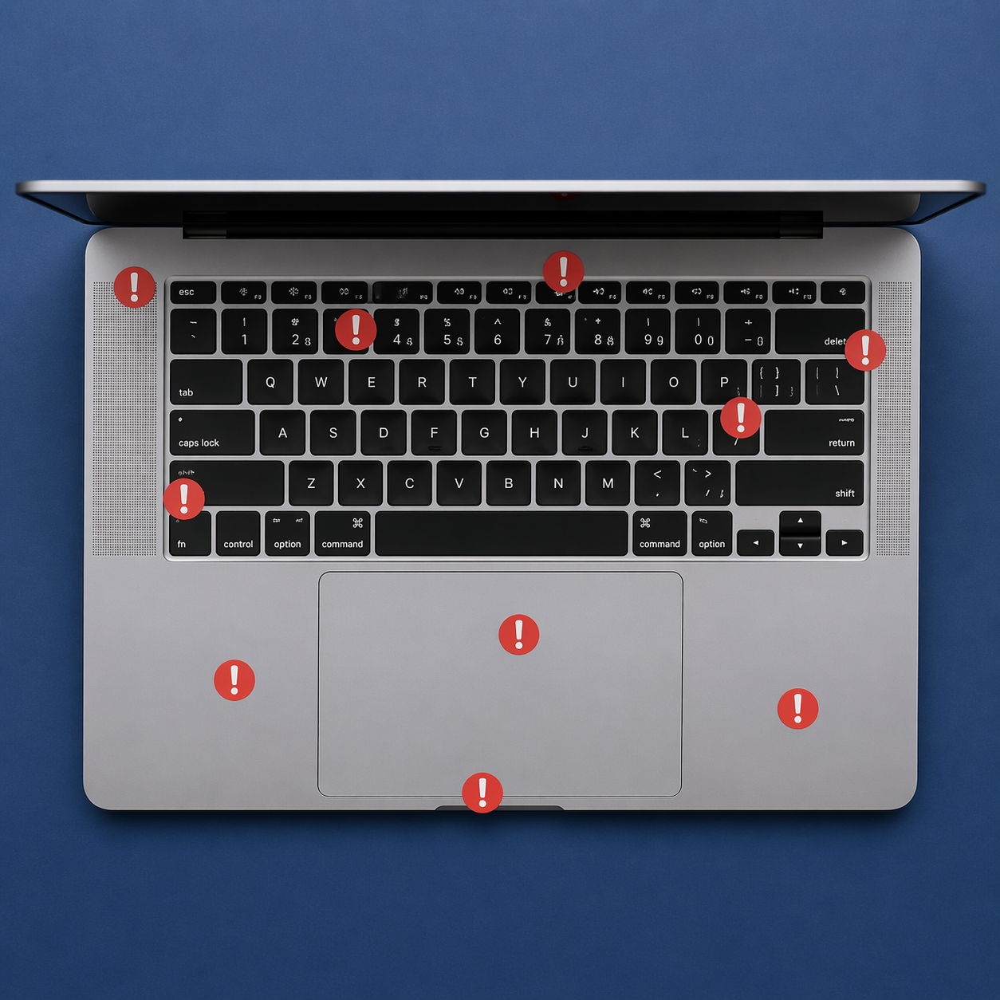
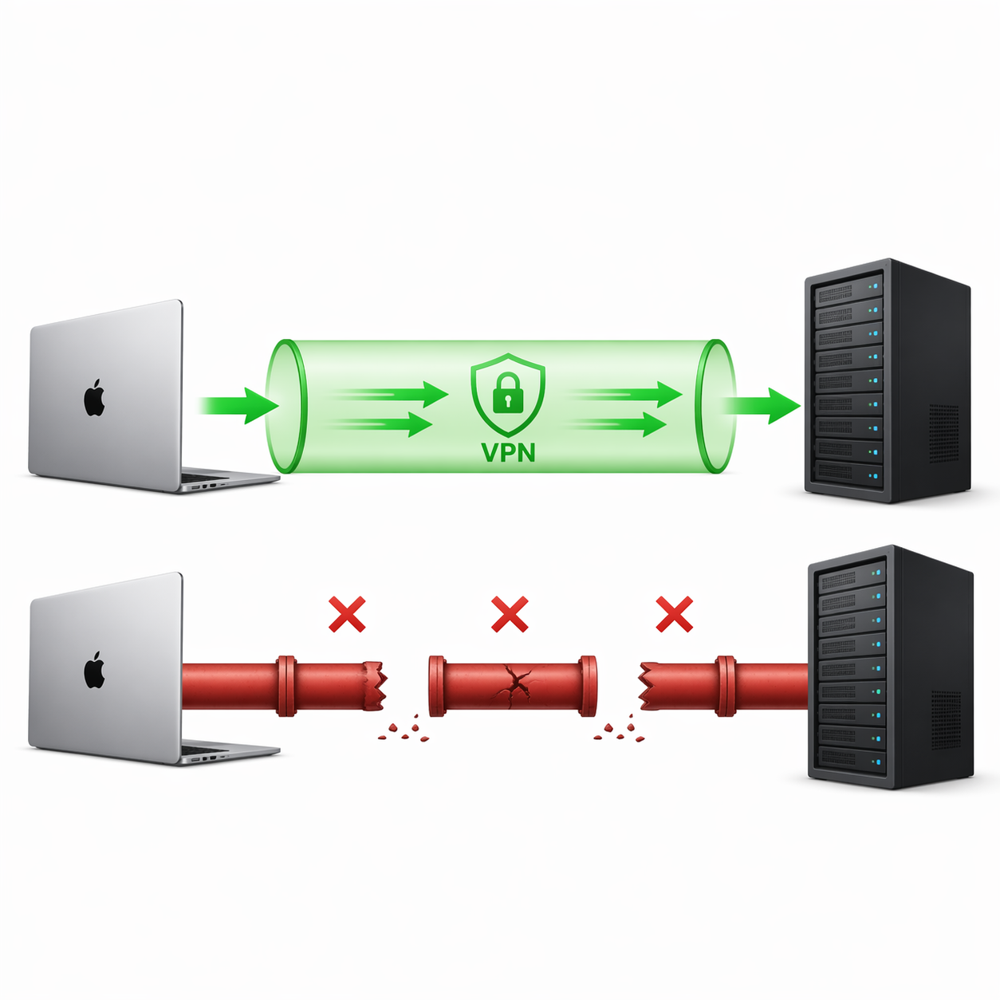
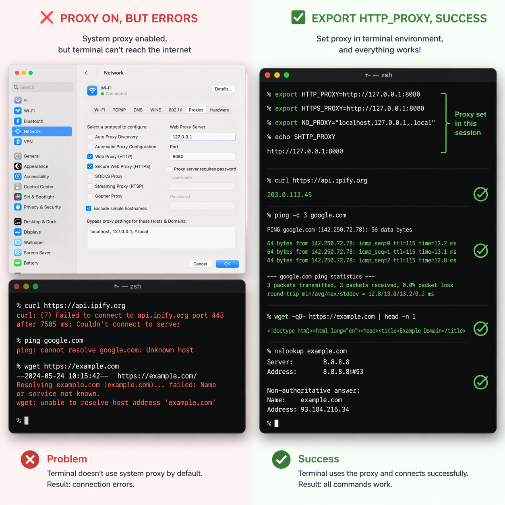
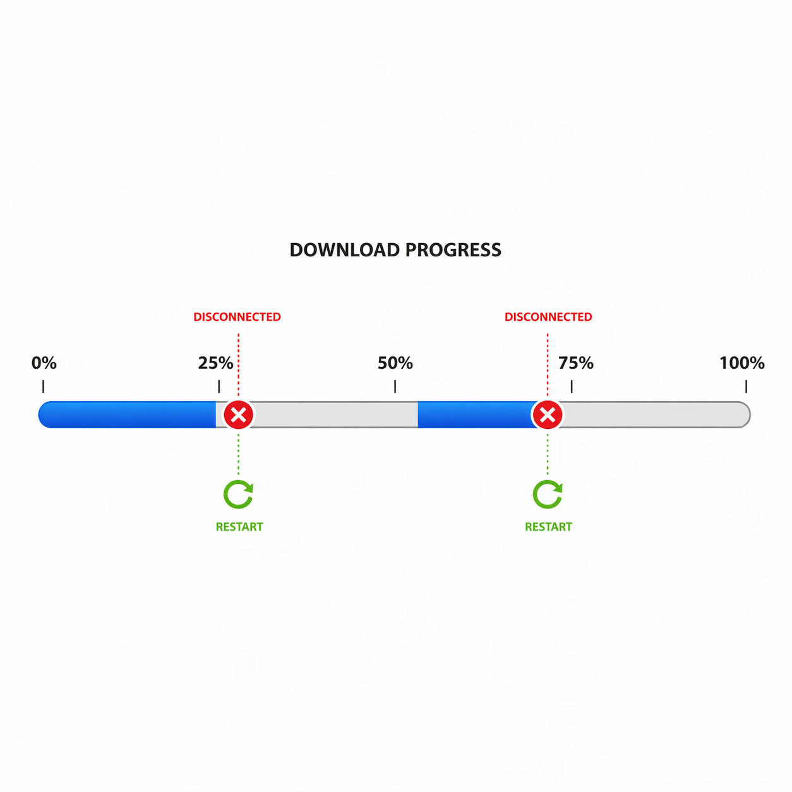
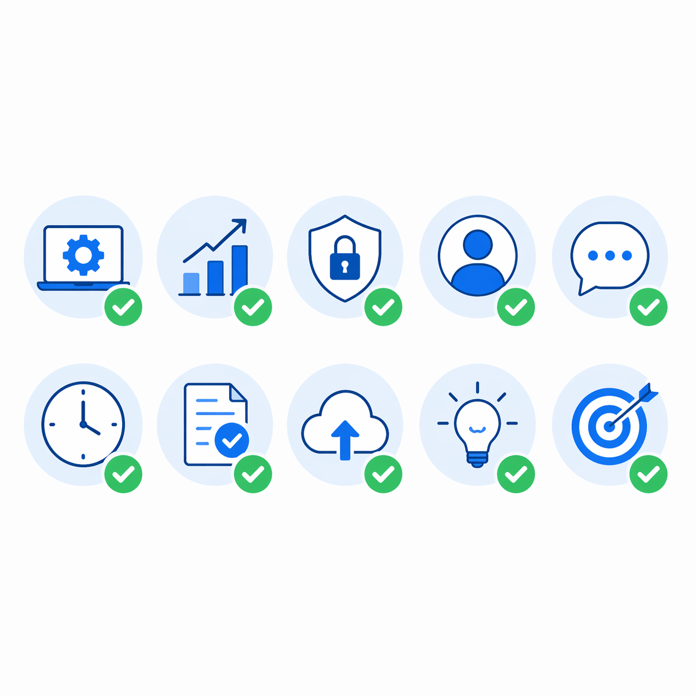

# 装机时踩的 10 个坑——国内 Mac 用户避坑指南

> 上一篇《我把装一台 M5 Max 这件事，全交给了 Claude Code》讲的是流程怎么走。这一篇讲的是**哪里会摔**。
>
> 装机省时间的关键不是按部就班，是提前知道哪里会摔。下面这 10 个坑，全部来自我 4 月 22 号拿到 M5 Max 128G 当天的真实踩坑记录——不是网上搜来的，是自己摔出来的。



---

### 1. 没装代理就硬装 brew，30 倍速差

**场景**：新机器开箱，迫不及待打开终端装 Homebrew，想着"先把工具装上再说"。

**错误反应**：直接跑官方安装脚本，然后盯着 `git fetch` 转圈等，等了 30 分钟还在 `Trying again in 2 seconds` 循环。心态从"等一等就好"变成"是不是命令打错了"。

**正确做法**：**先装代理（魔法），再装一切。** 代理是装机的第 -1 步，不是事后补救措施。装完代理后 GitHub / Homebrew / Docker Hub / npm / HuggingFace 全球源全通，省下的不是几分钟，是整个装机流程里反复绕路的时间。

**真实数据**：同一天下午装 `claude-code`——没代理卡了 30 分钟没装上，开代理后 1 分钟搞定。**30 倍速差。** 我当时的原话："都想给我自己一耳光，太傻了。"



---

### 2. 系统代理对终端 CLI 无效，必须手动 export

**场景**：代理装好了，Clash Verge 跑着，浏览器访问 GitHub 飞快。然后回到终端跑 `brew install` 或 `ollama pull`——还是卡。

**错误反应**："代理明明开着啊？" 反复检查 Clash Verge 是不是连上了，重启代理客户端，甚至怀疑是不是代理节点有问题。

**正确做法**：macOS 系统代理只对走系统网络框架的 App 生效（比如浏览器）。终端里的 CLI 工具（brew、curl、ollama、npm）**不读系统代理**，必须手动设环境变量：

```bash
export HTTP_PROXY=http://127.0.0.1:7897
export HTTPS_PROXY=http://127.0.0.1:7897
export ALL_PROXY=socks5://127.0.0.1:7897
```

建议直接加到 `~/.zshrc`，一劳永逸。端口号看你自己的代理客户端设置。

**真实数据**：`ollama pull` 拉 70B 大模型时，没设环境变量直接卡在 "pulling manifest" 转圈；设了之后立刻开始下载。



---

### 3. xcode-select --install 弹窗会藏在窗口后面

**场景**：第一步装 Xcode Command Line Tools，在终端输完 `xcode-select --install`，命令秒回，终端显示 `note: install requested for command line developer tools`。然后——什么都没发生。

**错误反应**：盯着终端等下一步提示，找了好几分钟。"不是应该在命令行确认的吗？怎么没反应？"

**正确做法**：这条命令会触发一个 **macOS 系统弹窗**（不是终端里的提示），弹窗经常被其他窗口遮住，特别是用 ToDesk 远程时位置更诡异。找法：

- **Cmd+Tab** 切窗口，找"安装程序"
- 检查 Dock 有没有蓝色弹跳图标
- 实在找不到就再跑一次命令，会重新弹

**涛哥原话**："我觉得苹果可以改进下，感觉不是很方便，我找了几分钟才看到不是在命令行确认的。" 这种"明明是命令行操作，却还要 GUI 确认"的设计，是 macOS 的老毛病。

---

### 4. sudo 密码盲打没回显，连错 3 次锁定

**场景**：装 Homebrew 需要 sudo 权限，终端提示 `Password:`。

**错误反应**：输密码时看不到任何字符（没有星号、没有圆点、什么都没有），以为键盘没反应，删了重输，结果看到 `Sorry, try again.`。

**正确做法**：这是 Unix 终端 sudo 的标准行为——**密码输入不回显**，连光标都不会动。你输的每一个字符都在，只是看不到。**慢点输，确认完一口气回车。** 连续输错 3 次会被锁定几分钟。

**真实数据**：我这次装 brew 时第一次输错了密码（截图里能看到 `Sorry, try again.`），后来配 BOTTLE 源时又输错了一次。两次都是输太快，盲打出了错。

---

### 5. brew 自带的 curl 不走系统代理

**场景**：你已经按坑 2 设了 `HTTP_PROXY` 环境变量，`brew install` 装 formula 没问题了。但装某些 cask（比如 Lark / Zoom 这种大体积 App）时，又卡住了。

**错误反应**："代理变量都设了啊，怎么还是慢？" 然后开始怀疑是镜像源的问题。

**正确做法**：brew 装 cask 时调用的下载链接，有些直接指向应用厂商的 CDN（比如飞书走的是新加坡 `sf16-sg.larksuitecdn.com`），这些 CDN 不经过 Homebrew 的 bottle 镜像。解决方案：

- 确保 `HTTPS_PROXY` 和 `ALL_PROXY` 都设了（不只是 `HTTP_PROXY`）
- 或者干脆跳过这个 cask，去官网下 DMG 手动装

**真实数据**：Lark 从新加坡 CDN 下载，速度约 1MB/分钟，等了 15 分钟只下了 71MB（总共 ~300MB），最后 kill 进程，去 lark.com 直接下载 DMG 秒装。

---

### 6. Lark CDN 从新加坡下载极慢（~1MB/分钟）

**场景**：`brew bundle` 跑 Brewfile，大部分 cask 几秒搞定，但跑到 Lark（飞书国际版）时进度条几乎不动。

**错误反应**：干等。"反正 brew 在跑，等就是了。" 结果一等就是十几分钟，而且后面排队的包也被堵住。

**正确做法**：`brew bundle` 是串行安装的，一个包卡住后面全等着。**发现某个 cask 下载速度异常（低于 5MB/s），果断 Ctrl+C，注释掉它，重跑 `brew bundle`——已装的包会跳过，不会重装。** 卡住的那个包后面单独处理。

**真实数据**：第一次 `brew bundle` 跑了 19 分钟，其中 15 分钟在等 Lark。注释掉 Lark 后重跑，剩下 79 个 formula + 15 个 cask 几分钟全部装完。

---

### 7. homebrew/bundle 和 homebrew/services tap 已 deprecated

**场景**：Brewfile 里写了 `tap "homebrew/bundle"` 和 `tap "homebrew/services"`，跑 `brew bundle` 时终端突然蹦出红色 `Error`。

**错误反应**：看到 Error 慌了——"是不是 Brewfile 写错了？要不要重来？"

**正确做法**：**不要慌，这两个 tap 已经合并进 brew 主体了。** `brew bundle` 和 `brew services` 现在是内置子命令，不需要单独 tap。报 Error 但 **exit code 不影响其他包安装**，后面的 formula 和 cask 照常装。

可以从 Brewfile 里删掉这两行，干净一点。但不删也不会坏事。

---

### 8. swiftlint 必须等 Xcode 装完才能 brew install

**场景**：阶段 1 装核心工具时，`brew install swiftlint` 报错 `no Xcode installation found`。

**错误反应**："不是已经装了 Xcode Command Line Tools 吗？" 反复跑 `xcode-select -p` 确认 CLT 在，但 swiftlint 就是装不上。

**正确做法**：swiftlint 依赖的是**完整的 Xcode**（App Store 里那个 15GB 的），不是 Command Line Tools。CLT 是 Xcode 的子集，只有 git / clang / make 等基础工具，没有 Swift 的完整工具链。

正确顺序：先从 App Store 装 Xcode → 等它装完 → 再 `brew install swiftlint`。如果你的项目不需要 iOS 开发，可以跳过 swiftlint。

---

### 9. ollama pull 大模型会断连，但支持断点续传

**场景**：`ollama pull llama3.3:70b-instruct-q4_K_M`（42GB），跑到一半突然报 `EOF` 或 `connection reset`。

**错误反应**："断了？是不是要从头来？" 删掉已下载的部分，重新 `ollama pull`，又从 0% 开始。

**正确做法**：**不要删，直接重跑 `ollama pull` 即可。** Ollama 支持断点续传，它会从上次断掉的地方接着下。大模型文件几十 GB，代理连接不稳定断个几次太正常了。

**真实数据**：
- Llama 3.3 70B（42GB）：断了 2 次，39% → 92% → 100%
- Qwen 2.5 72B（47GB）：断了 3 次，28% → 45% → 81% → 100%

看到 EOF 别慌，重跑就行。总共 89GB 的模型，断断续续全拉完了。



---

### 10. OrbStack 装完需要首次 GUI 启动才能用 docker 命令

**场景**：`brew install --cask orbstack` 装完，终端跑 `docker ps`——报错 `command not found` 或 `Cannot connect to the Docker daemon`。

**错误反应**："brew 不是装好了吗？怎么 docker 命令不好使？" 开始查 PATH 配置、折腾环境变量。

**正确做法**：OrbStack 通过 brew 安装后，**必须手动打开一次 OrbStack.app**。第一次启动会：
1. 创建 `/var/run/docker.sock`
2. 申请系统权限（网络 + 虚拟化）
3. 注册 `docker` / `docker-compose` 命令到 PATH

之后就不需要再手动打开了，OrbStack 后台服务会自动跑。但第一次——必须 GUI 启动。

---



## 所有坑的元规律：国内开发者的"前置基础设施债"

回头看这 10 个坑，有 6 个跟网络有关（代理、镜像、CDN、断连），2 个跟 macOS 的 CLI/GUI 割裂有关（xcode-select 弹窗、OrbStack 首次启动），2 个是知识盲区（sudo 盲打、依赖关系）。

这不是个人能力问题，是**国内开发者每次配新机都要重新还的"前置基础设施债"**——代理要重装、镜像要重配、环境变量要重写、字体要重装。每一项单独看都不难，但叠在一起就是半天时间。

这也是我做 [setup-m5-max](https://github.com/sit-in/setup-m5-max) 这个仓库的原因——**把这些前置基础设施债沉淀成代码**。一个 `git clone` + 一个 `brew bundle`，把"半天踩坑"变成"半小时装完"。下次换机器，不用再摔一遍。

---

## 关于我

涛哥，独立开发者，目前在用 Claude Code 做各种有意思的事。

- **想用 Claude Code / Gemini / ChatGPT 但不想折腾 API？** → [AIGoCode.com](https://aigocode.com)，国内直连的 AI API 中转，注册就能用
- **需要 AI 生图？** → [HiAPI.ai](https://hiapi.ai)，新人 50 张图免费
- **想聊 AI、装机、独立开发？** → 微信 257735，备注【AI】

装机工具包开源在 GitHub：[sit-in/setup-m5-max](https://github.com/sit-in/setup-m5-max)，欢迎 star。
